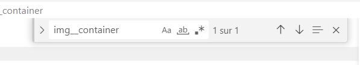
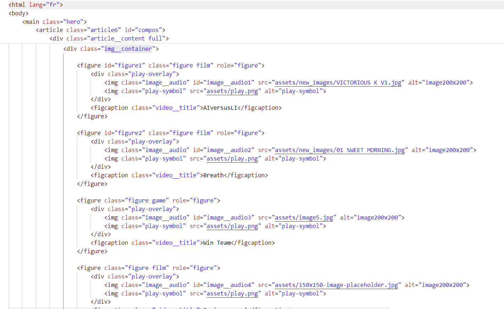
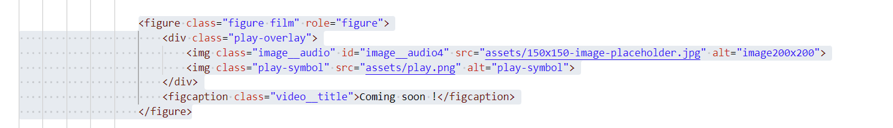
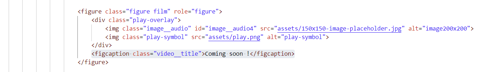
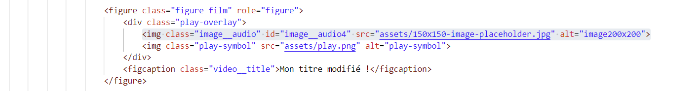
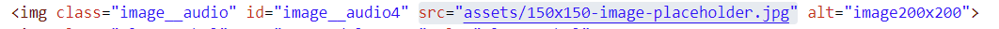
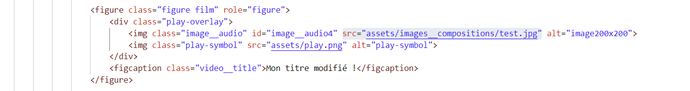
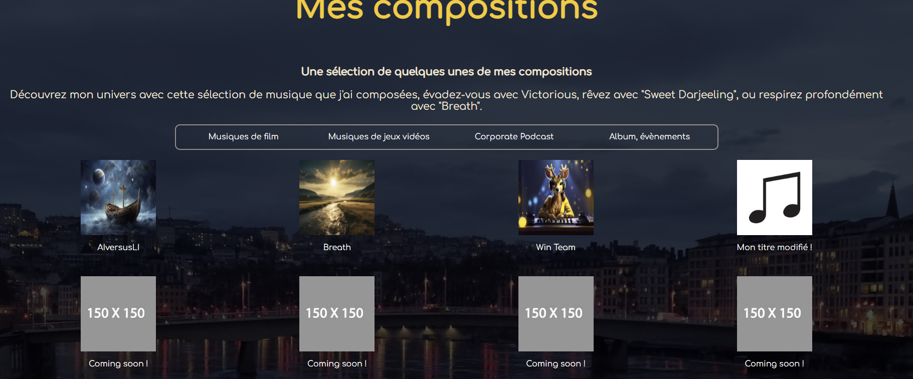
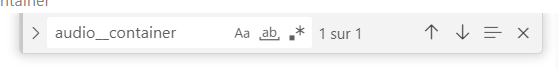
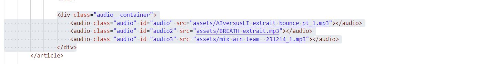

# POUR AJOUTER UNE NOUVELLE MUSIQUE SUR LA PARTIE "MES COMPOSITIONS"

## Cas 1 : Remplacer un des encadrés vide "Coming Soon" par une nouvelle musique et son image

- Aller dans le fichier ``index.html``
- Pour voir en direct les modifications, on appuie sur le petit bouton "go live" en bas à droite de l'éditeur de code.

- Une fois dans ```index.html```, faire le raccourci clavier ```ctrl + F``` 
- Sur la petite barre qui est apparue en haut à droite, écrire **img_container** (voir screenshot)



- On arrive donc sur la partie du code relative aux compositions, avec toutes les musiques dans le conteneur ``img__container``


*Ici on a la liste des images cliquables de la partie compositions, chaque image/musique est contenue dans une balise ```<figure></figure>```*

- Fermer la barre de recherche avec la petite croix
- Sur la partie **figure** on a plusieurs éléments qu'il faudra modifier (j'ai pris ici un des éléments vide "coming soon")


- Tout d'abord **modifier le titre** de la musique en modifiant le contenu de la balise ```figcaption``` (figcaption veut dire légende, on modifie le titre de l'image, pour des raison sémantiques, j'ai utilisé la balise figcaption)

*Ici, on remplacera "coming soon !" par le titre de la musique.*
### ON OUBLIE PAS ```CTRL + S``` A CHAQUE MODIFICATION DU CODE POUR SAUVEGARDER

- On doit ensuite modifier l'image affichée, pour cela on modifie la première balise `````` (celle qui possède **l'attribut** ```class="image__audio"```)

*Ici, on va modifier **l'attribut** ```src``` de l'image, il s'agit du lien source de l'image, où l'image va aller chercher le fichier qu'on veut afficher.*

- On va aller modifier **l'attribut ```src```** qui indique le fichier que la balise image doit afficher.


    *Ici, on voit que l'image pointe vers le fichier "assets" qui est dans le même dossier que les autres fichiers du site*

- Il faudra préalablement télécharger l'image qu'on souhaite afficher, et la copier coller dans un des dossiers à l'intérieur du dossier **assets**, on utilisera ici le dossier **"images__compositions"** qui est situé dans le dossier assets. C'est là où tu disposeras toutes tes images. 

- L'image avec le ```src``` modifié ressemblera donc à cela (avec le vrai nom de l'image à la place de "mon__image.png"). 



- Et voilà ! Mon image est modifiée ! (on oublie pas de faire ```ctrl + S``` à chaque étape afin de bien enregistrer les modifications)


- L'étape suivante est d'aller créer un fichier audio correspondant afin que le bon audio se lance **au moment du clic sur l'image**, contenus en bas du conteneur des images (```img__container```)
- On voit que sur notre exemple, l'image que nous avons modifié possède l'attribut ```id="image__audio4"``` (voir screenshot plus haut).
- Depuis ```index.html``` on effectue de nouveau le raccourci ```ctrl + F```.
- Cette fois, on recherche ```audio__container```.



- On arrive à la partie du code contenant les fichiers audio relatifs aux images plus haut. 


- On va maintenant lui attribuer un fichier audio avec une balise ```<audio>```.

- On copie le dernier fichier audio, et on colle la ligne juste en dessous, pour créer un nouvel ```<audio>``` qu'on va modifier.


- On modifie le ```id``` de la balise ```<audio>``` ainsi que le ```src```. On a modifié l'image qui a l'id ```"image__audio4"```, on attribue à la balise ```<audio>``` l'id "audio4" . On lui indique également l'emplacement du fichier audio, qui sera dans le dossier ```assets```.
